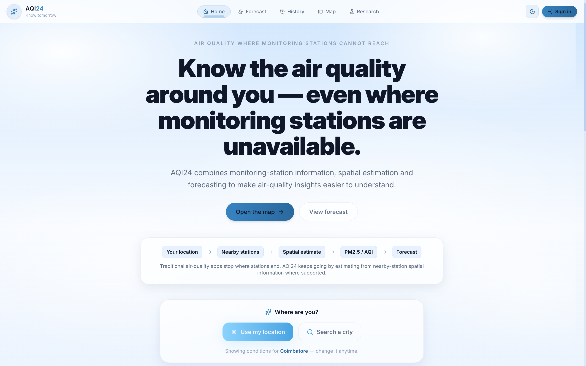

<div align="center">

# AQI24

### Know tomorrow. Understand what comes next.

**Environmental intelligence for India's air.**

<a href="https://aqi-24.vercel.app/">
  
</a>

<br><br>

<a href="https://aqi-24.vercel.app/">
  
</a>

</div>

---

## 🌍 About

AQI24 is an environmental intelligence platform designed to provide a clear and honest view of India's air quality by combining station observations, atmospheric forecasts, historical references, satellite/fire data, and research-oriented analysis.

> **AQI24 never fabricates AQI values.**  
> Observed, forecast, and modeled data are clearly distinguished throughout the application.

---

## ✨ Features

- Current station AQI
- 7-day air-quality forecast
- Historical air-quality analysis
- Interactive air-quality and fire map
- Research & methodology hub
- Environmental indicators and analytics
- Health guidance by AQI category
- Optional saved locations and user profiles
- ML/DL experimentation for environmental analysis

---

## 🔬 Data Sources

| Data | Source |
|---|---|
| Current station AQI | WAQI |
| Active fires | NASA FIRMS |
| 7-day forecast | Open-Meteo CAMS |
| Historical reference | CPCB baselines + NCAP targets |

Forecast AQI is derived from CAMS PM2.5 forecasts using EPA AQI breakpoints.

Historical values are explicitly labeled as **modeled estimates/reference** and are never presented as raw observations.

---

## 🧠 ML / Research

Current experimental work includes:

- Fire intensity regression
- Fire severity classification
- Historical environmental analytics
- Ongoing ML/DL development for AQI24

The current AQI forecast uses the **Open-Meteo CAMS atmospheric model**. An AQI24-trained forecasting model is future work.

---

## 🛠 Tech Stack

`Vite` · `React` · `Leaflet` · `Recharts` · `Supabase`

---

## 🚀 Run Locally

```bash
git clone https://github.com/Sanjai-Gopal/AQI24.git
cd AQI24
npm install
npm run dev
